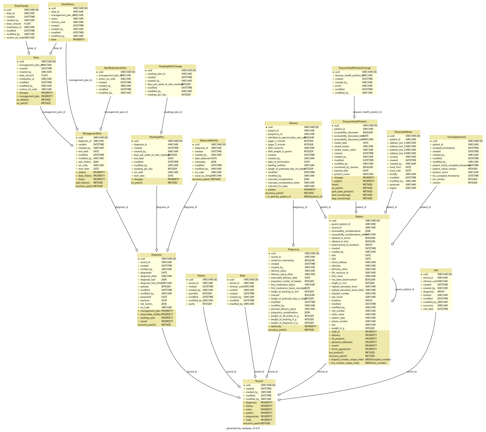

# Polaris Services API

[](https://github.com/ambv/black)

The Services API is part of the Polaris platform (formerly DHOS). This service stores information about patients and
their medical records.

## Maintainers
The Polaris platform was created by Sensyne Health Ltd., and has now been made open-source. As a result, some of the
instructions, setup and configuration will no longer be relevant to third party contributors. For example, some of
the libraries used may not be publicly available, or docker images may not be accessible externally. In addition, 
CICD pipelines may no longer function.

For now, Sensyne Health Ltd. and its employees are the maintainers of this repository.

## Setup
These setup instructions assume you are using out-of-the-box installations of:
- `pre-commit` (https://pre-commit.com/)
- `pyenv` (https://github.com/pyenv/pyenv)
- `poetry` (https://python-poetry.org/)

You can run the following commands locally:
```bash
make install  # Creates a virtual environment using pyenv and installs the dependencies using poetry
make lint  # Runs linting/quality tools including black, isort and mypy
make test  # Runs unit tests
```

You can also run the service locally using the script `run_local.sh`, or in dockerized form by running:
```bash
docker build . -t <tag>
docker run <tag>
```

`make test` will by default skip all tests that require neo4j content.
To run the full suite of unit tests use `make test-all` (or `make lint test-all`). 

You can run pytest with arguments by running `tox` directly and putting the additional arguments after a `--` separator.
e.g. `tox -- --pdb` will enter the debugger on the first failing test.

`make test`, `make test-all` and `tox` start neo4j in a docker container. This container maps to randomly selected port
numbers so will not conflict with an existing local neo4j container. Running `tox -e py37` will run the tests without
starting a fresh neo4j, in this case the usual NEO4J environment variables may be used to configure the connection.

## Integration tests

To run integration tests locally:

```bash
$ cd integration-tests
$ make test-output
```

Runs all integration tests but only displays output from the integration test container itself. When the run is complete
the containers will shut down automatically.

```bash
$ cd integration-tests
$ make test-local
```

Runs all integration tests locally and displays output from all docker containers. Use control-C to shut down the docker 
containers when the run is complete. Use this command if you need to inspect running containers or see output from the
api's under test in order to debug a failing test.

You may pass additional arguments to ``behave`` by setting the environment variable ``BEHAVE_ARGS``. For example:

```bash
$ cd integration-tests
$ BEHAVE_ARGS="-n 'Delete dh_product from patient'" make test-output
```
will run a single scenario 'Delete dh_product from patient'.

### Api integration tests

Most of the integration tests use a common format which may not follow best-practice but allows a few parametrized test
steps to be re-used for many tests.

e.g.
```gherkin
    Scenario: Delete dh_product from patient
    Given a patient exists
     And we GET from dhos/v1/patient/{context.patient_uuid}?type=GDM
     And  we save {context.output[dh_products][0][uuid]} as dh_product_uuid
    When we DELETE to dhos/v1/patient/{context.patient_uuid} with data from test_40_delete_dh_product_from_patient/input_40.json
    Then the response matches test_40_delete_dh_product_from_patient/output_40.json
```
URL fragments in parametrized steps may include context variables using Python's string format syntax. The same
format syntax may also be used to save a value from the output of a step so that it may be used in a future step.

Data for POST/PATCH/DELETE is read from an ``input_xx.json`` file which contains a JSON object. If the object has attributes 
`"data"` and `"patches"` then the actual object used is constructed by applying the JSON patch in `"patches"` to the template
object in `"data"`. Otherwise the original object is used unchanged.

Response matching applies a JSON patch object to `context.output` after removing some ignored attributes 
(`created`, `created_by`, `modified`, `modified_by`).
The test will fail if the patch cannot be applied. The result of the patch is discarded, `context.output` itself
is not changed by anything in the patch.

#### JSON patch

JSON patch objects are a list of objects matching the following formats:

```
{ "op": "add", "path": "<JSON path>", "value": <JSON> }
{ "op": "remove", "path": "<JSON path>" }
{ "op": "replace", "path": "<JSON path>", "value": <JSON> }
{ "op": "copy", "from": "<JSON path>", "path": "<JSON path>" }
{ "op": "move", "from": "<JSON path>", "path": "<JSON path>" }
{ "op": "test", "path": "<JSON path>", "value": <JSON> }
```
See http://jsonpatch.com for a full specification.

A test will fail if the patch cannot be applied: e.g. `add` fails if the element already exists, `remove` or `replace` fail 
if it does not exist.
`test` will fail unless the object exactly matches the `value`. This means for example that in a test `remove` is used 
as an assertion that a field is present but has an unknown value (such as a UUID).

The patches used in the integration tests may contain an additional attribute `value_format` which may be a string or a 
list of strings in Python format syntax. If present the `value` attribute is created from the formatted strings.

## Data model (Neo4j)

![alt text][db_layout]

[db_layout]: docs/diagram_db.png "Database layout"

## Database (SQL)

<!-- Rebuild this diagram with `make readme` -->
  

